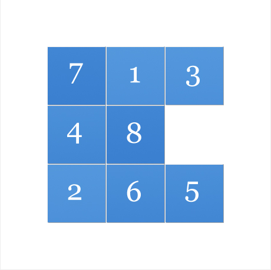

# puzzle

## What is this

Well... this is obviously not a puzzle  
Yep, it is not; it is a **puzzle terminator**.  

## Compile
Make sure you have `gcc`, `make` and `pthread library`  
Once you have all of those  
```
$ make
```
Output file is a executable(`puzzle` or `puzzle.exe`... depends on your platform)  

## Basic Use
First, run the executable and you should see  
```
SIZE = 3x3
THREADS = 1
LEVEL = FAST
Input puzzle for GOAL:
(...wait for input)
```
  
`SIZE` is the size of the puzzle.  
In this case is 3x3 (This is default value)  .
  
`THREADS` indicates how many threads will be participating in finding an answer  
In this case is just one(This is default value).  
  
`LEVEL = FAST` means that the program will search for an quick, but not best answer.  
(This is default value)  
  
In the contrast,  
`LEVEL = BEST` will cost a lot of time and memory  
(and high chance of crashing if you are compiling in 32bit)  
for the best solution.  
  
--------
  
Second, you need a unsolved 8-puzzle.  
Like this  
  
[Source](http://mypuzzle.org/sliding)  
  
The typical goal for this game is  
```
1 2 3
4 5 6
7 8 0
```
And the current game is  
```
7 1 3
4 8 0
2 6 5
```
Type those to this program and it will **crack it** in just few seconds.  
Hit `Enter` to see steps to the solution.  

## Advance Use
### ``THREAD``
You may want to specify more number of threads if you have more than one core  
For example, this will have 4 threads runnung to solve the game.
```
$ ./puzzle thread 4
```
  
--------
  
### ``SIZE``
You may want to specify larger size of game if you are bored of 3x3 puzzle.  
For example, this will change from 3x3 to 5x5.  
```
$ ./puzzle size 5
```
  
--------
  
### ``NONINTERACT``
You may not want to hit `Enter` multiple times in order to see all detailed steps  
(This is common when redirecting output to a file.)  
if this argument is set, then the program will not wait before printing solution steps.  
```
$ ./puzzle noninteract
```
  
--------
  
### ``BEST``
You may want the perfect solution with least moves.  
**USE WITH CAUTION, NOT RECOMMENDED IN 32-BIT**  
if this argument is set, then the program will try to find the best result(see above).  
```
$ ./puzzle best
```
  
--------
  
### Combined?
All of the above arguments can be used in combination.   
For example
```
# ./puzzle size 5 thread 4
```
